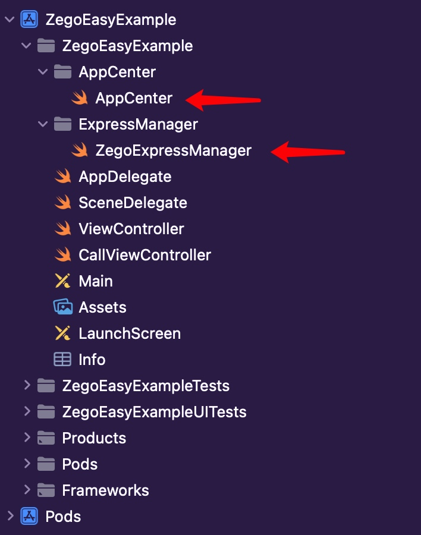

# ZEGOCLOUD easy example
<p align="center">
    <a href="https://github.com/ZEGOCLOUD/easy_example_ios/releases"></a>
    <a href="https://discord.gg/EtNRATttyp">
        
    </a>
    <p>
    <p>Click the search button below to search documentation or error code</p>
    <a href="https://docs.zegocloud.com/">
        
    </a>
    </p>
</p>

ZEGOCLOUD's easy example is a simple wrapper around our RTC product. You can refer to the sample code for quick integration.

## Getting started

### Prerequisites

* [Xcode 12 or later](https://developer.apple.com/xcode/download)
* [CocoaPods](https://guides.cocoapods.org/using/getting-started.html#installation)
* An iOS device or Simulator that is running on iOS 13.0 or later and supports audio and video. We recommend you use a real device.
* Create a project in [ZEGOCLOUD Admin Console](https://console.zegocloud.com/). For details, see [ZEGO Admin Console - Project management](https://docs.zegocloud.com/article/1271).

###  Install Pods
1. Clone the easy example Github repository. 
2. Open Terminal, navigate to the `ZegoEasyExample` folder where the `Podfile` is located, and run the `pod repo update` command.
3. Run the `pod install` command to install all dependencies that are needed.

### Modify the project configurations

You need to modify `appID` and `appSign` to your own account, which can be obtained in the [ZEGO Admin Console](https://console.zegocloud.com/).

### Run the sample code

1. Connect the iOS device to your computer.

2. Open Xcode, click the **Any iOS Device** in the upper left corner, select the iOS device you are using.

3. Click the **Build** button in the upper left corner to run the sample code and experience the Live Audio Room service.

## Integrate the SDK into your own project

### Introduce SDK
1 add `ZegoExpressEngine` SDK in your project 
2 Run the `pod install` command to install all dependencies that are needed.

```swift
target 'Your_Project_Name' do
  # Comment the next line if you don't want to use dynamic frameworks
  use_frameworks!

  # Pods for ZegoEasyExample
  pod 'ZegoExpressEngine'

end
```
### Copy the source code
Copy the `AppCenter.swift` and `ZegoExpressManager.swift` files to your project

### Method call
The calling sequence of the SDK interface is as follows:
createEngine --> joinRoom --> setLocalVideoView/setRemoteVideoView --> leaveRoom

#### Create engine
Before using the SDK function, you need to create the SDK first. We recommend creating it when the application starts. The sample code is as follows:
```swift
func application(_ application: UIApplication, didFinishLaunchingWithOptions launchOptions: [UIApplication.LaunchOptionsKey: Any]?) -> Bool {
        // create engine
        ZegoExpressManager.shared.createEngine(appID: AppCenter.appID, appSign: AppCenter.appSign)
        return true
    }
```

#### Join room
When you want to communicate with audio and video, you need to call the join room interface first. According to your business scenario, you can set different audio and video controls through options, such as:

1. call scene：[.autoPlayVideo, .autoPlayAudio, .publishLocalAudio, .publishLocalVideo]
2. Live scene - host: [.autoPlayVideo, .autoPlayAudio, .publishLocalAudio, .publishLocalVideo]
3. Live scene - audience:[.autoPlayVideo, .autoPlayAudio]
4. Chat room - host:[.autoPlayAudio, .publishLocalAudio]
5. Chat room - audience:[.autoPlayAudio]

The following sample code is an example of a call scenario:
```swift
    @IBAction func pressJoinRoom(_ sender: UIButton) {
        
        // join room
        let roomID = "111"
        let user = ZegoUser(userID: "id\(Int(arc4random()))", userName: "Tim")
        let option: ZegoMediaOptions = [.autoPlayVideo, .autoPlayAudio, .publishLocalAudio, .publishLocalVideo]
        ZegoExpressManager.shared.joinRoom(roomID: roomID, user: user, options: option)
        presentVideoVC()
    }
```
#### set video view
If your project needs to use the video communication function, you need to set the View for displaying the video, call `setLocalVideoView` for the local video, and call `setRemoteVideoView` for the remote video.

**setLocalVideoView:**
```swift
    override func viewDidLoad() {
        super.viewDidLoad()
        self.view.backgroundColor = UIColor.white
        // set video view
        ZegoExpressManager.shared.setLocalVideoView(renderView: localVideoView)
        
    }
```

**setRemoteVideoView:**
```swift
   func onRoomUserUpdate(udpateType: ZegoUpdateType, userList: [String], roomID: String) {
        for userID in userList {
            // set video view
            ZegoExpressManager.shared.setRemoteVideoView(userID:userID, renderView: remoteVideoView)
        }
    }
```

#### leave room
When you want to leave the room, you can call the leaveroom interface.
```swift
@IBAction func pressLeaveRoomButton(_ sender: Any) {
    ZegoExpressManager.shared.leaveRoom()
    self.dismiss(animated: true, completion: nil)
}
```
